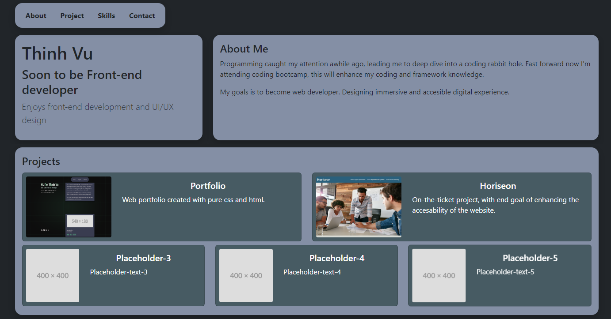
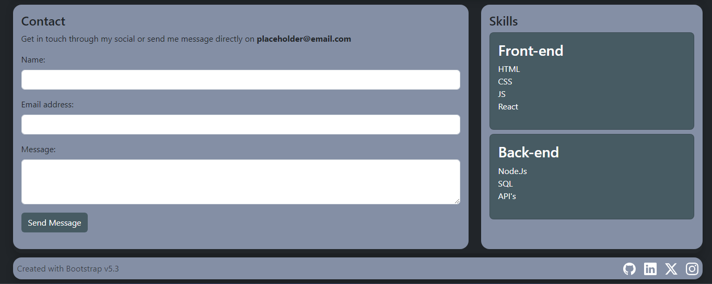

# bootsrap-portfolio

## Description 

Part of edx-bootcamp challenge. For this particular challenge I had to design a portfolio using bootstrap framework. This is my first time using this framework, so there was tons of new classes to learn and utilise.

This portfolio is split into 4 section; first one is quick introducion about myself, followed by the project section which has cards to showcase the projects that I've worked on so far. The contact section that will be used to contact me through mails or socials. Lastly the skills, for now will be list of skills that I wish to learn during this bootcamp.

Overall this is good beginning and introduction to boostrap framework. Had a solid go at it and is happy with the result. However, will definietly learn more of bootstrap and to create better and more professional looking website.

## Screenshots 

Following images displays the look of the portfolio.

## URL 

Following url will take you to the deployed website:

